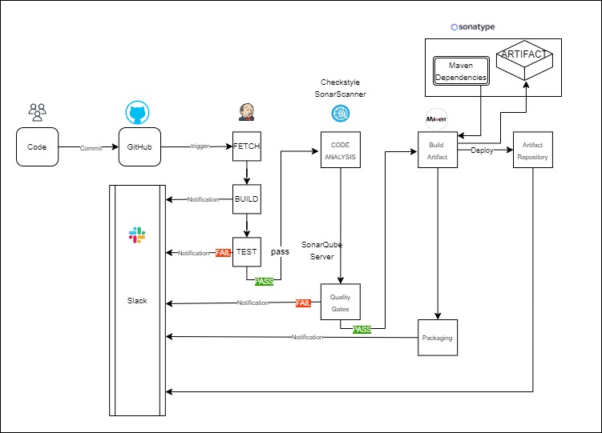

# CI-Jenkins
## CI Pipeline with Jenkins, Nexus, Sonarqube and Slack

The CI pipeline aims to: 

* Quickly identify and resolve issues
* Shorten feedback and test cycles
* Integrate changes quickly and with less disruption

We achieve this by:
* Frequent code testing
* Early bug detection and fix
* Releasing integrated, tested code

## Architecture:


## Tools and Services Used
| Tools | USE | 
| ------------- | ------------- | 
|🖥️ AWS EC2 | Host Jenkins, Nexus and SonarQube |
|🤖 Jenkins | continuous Integration tool |
| GitHub | Version control |
|🔍 Checkstyle | Code analysis plugin for Jenkins | 
|🔍 Sonarscanner | Analyzes projects and uploads results to SonarQube | 
|📊 SonarQube Server | Code Analysis Server | 
|🛠 Maven | Build tool  | 
|📦 Nexus Sonartype | Maven repository manager |
|🔔 Slack | Notification integration |


## Learning Objectives
- Gain familiarity with various AWS services.
- Understand and implement a working CI pipeline
- Understanding terraform infrastructure

## Implementation
1. **build infrastructure with terraform** 
2. **Launch EC2 Instances** 
3. **Post Installation Configuration** 
    * Setup Jenkins user and install essential plugins.
    * Configure Nexus repositories for artifacts, Maven dependencies and snapshots.
    * Test SonarQube login through the browser using the public IP.
4. **Jenkins Setup** 
    * Install required tools like OpenJDK 8 and Maven.
    * Set up tool tools on Jenkins.
    * Create and Enter Nexus login credentials.
5. **Jenkins Job Creation** 
    * Create a Jenkins job for the CI pipeline using the provided Git repository.
    * Configure a webhook on GitHub to trigger builds on commits.
6. **SonarQube Integration** 
    * Integrate **SonarQube** into the CI pipeline to perform code analysis.
    * Configure SonarQube server authentication in Jenkins.
7. **Configuring SonarQube Server**
    * Create quality gates in SonarQube
    * Create a webhook for Jenkins
8. **Nexus Artifact Management** upload artifact to Nexus repositories.
9. **Slack Notifications** - Integrate Slack for notification purposes, ensuring authentication and appropriate channels.

## Prerequisites:
- active AWS account

## Detailed Steps
### 1.  Security Groups Setup


### 3. Post Installation 
1. Setup Jenkins user and install plugins:
    * `Maven Integration`
    * `Github Integration`
    * `Nexus Artifact Uploader`
    * `SonarQube Scanner`
    * `Slack Notification`
    * `Build Timestamp`

2. Configure Nexus with repositories:
    1. Sign in through browser and get initial password from instance
    2. choose: **Disable anonymous access**
    3. Create 4 repositories:
        1. for storing artifacts
            - recipe: Maven2 (hosted)
            - name: **`vprofile-release`**
        2. for storing maven dependencies
            - recipe: Maven2 (proxy)
            - name: **`vpro-maven-central`**
            - remote storage: `https://repo1.maven.org/maven2/`
        3. snapshot repository
            - recipe: Maven2 (hosted)
            - name: **`vpro-snapshot`**
            - version policy: `snapshot`
        4. for grouping previous repos
            - recipe: Maven2 (group)
            - name: **`vpro-maven-group`**

3. Test SonarQube login to verify successful installation through the browser (using PUBLIC IP)

### 4. Jenkins Setup
 
- SSH into the `JenkinsServer` instance using the `jenkins-key` key pair
- Update the system and install OpenJDK 8 and Maven:
```bash
sudo apt update
sudo apt install openjdk-8-jdk maven
```

- Set up Jenkins tools for JDK and Maven.
##### In Jenkins, go to "manage jenkins" > "Tools"
- Add a new JDK tool named `OracleJDK8` with the path `/usr/lib/jvm/java-1.8.0-openjdk-amd64`.
- Add a new JDK tool named `OracleJDK11` with the path `/usr/lib/jvm/java-1.8.0-openjdk-amd64`.
- Add a new Maven tool named `MAVEN3` with version `3.9.5`.

- Save Nexus Login Credentials:

##### In Jenkins, go to "Manage Jenkins" > "Manage Credentials" 
- Add a new `Username with password`    credential:
    - Username: `admin`
    -   Password: Enter `<NexusPassword>`
    - ID: `nexuslogin`
    - Description: `nexuslogin`
     
### 5. Jenkins Job Creation :
#### 1. Create a Jenkins job
##### In Jenkins, go to "New Item / Create a job"
- Name: `vprofile-ci-pipline`
- type: `Pipeline`
- choose: `pipeline script from SCM`
- SCM: `Git`
    - Repository URL: `git@github.com:myacov/CI-Jenkins.git`
    - Add Jenkins Credential
        - Kind: `SSH Username with private key`
        - ID: `githublogin`
        - Description: github login
        - Username: `git`
        - private key : choose : `Enter directly` - paste private key from `cat ~/.ssh/id_rsa`
    - Select credential: `git(githublogin)`

    - in order to fix error we need to ssh into JenkinsServer and store the github identity. switch to root user and then to jenkins user and run: `git ls-remote -h git@github.com:myacov/CI-Jenkins.git HEAD`
    - identity will be stored at  `.ssh/known_hosts`

#### 2. GitHub Webhook - Creating Build Triggers
##### **in GitHub:** , go to repo settings > "Webhooks" > "Add Webhook"
    
- Payload URL: `http://<JenkinsServer IP>:8080/github-webhook/`
- Content type: `application/json`
- trigger: `push event`
##### In Jenkins, go to "`vprofile-ci-pipline` JOB" > "Configure" > "Build Triggers"

- choose: `GitHub hook trigger for GITScm polling`
### 6. SonarQube Scanner Integration
we need a tool that can analyize and present test results - SonarQube server.
we need: 
1. SonarQube Scanner tool to scan the code 
##### In Jenkins, go to ""manage jenkins" > "Tools" > "SonarQube Scanner" 

- Add SonarQube Scanner
    - Name: `sonarscanner`
    - Version: `SonarQube Sacnner 4.7.0.2747`

2. we need the SonarQube server information in Jenkins so it knows where to upload. In order for Jenkins to authenticate SonarQube server, we generate a token:
##### **in SonarQube Dashboard:**, go to Admin > "my account" > "Security" > "Generate token"
- Name: `jenkins`
- SAVE `TOKEN` that was created

##### In Jenkins, go to "manage jenkins" > "System" > "SonarQube" 
- Add SonarQube
    - [x] Environment Variables
    - Name: `sonarserver`
    - Server URL: `http://<SonarServer Private IP>/`
    - Server authentication token: + Add 
    - Add Jenkins Credential:
        - Kind: `Secret text`
        - Secret: enter the `TOKEN` from SonarQube dashboard
        - Name: `sonartoken`
        - Description: `sonartoken`
    - Select `sonartoken`


### 7. Configuring SonarQube Server 

#### 1. Create a quality gate
##### in SonarQube, go to "Quality Gates" > "Create"
- Name: `vprofile QG`  
- Add condition:
    - [x] on overall code
    - quality gate fails when: `bugs` are greater than `25`
- Attach quality gate:       
    - project > Project settings > Quality Gate > Select: `vprofile QG`

#### 2. add webhook for Jenkins:
##### In SonarQube, go to project > "Project settings" > "Webhooks" > "Create" 
- Name: `jenkinswebhook`
- URL: `http://<Jenkins_private_IP>:8080/sonarqube-webhook`

### 8. Nexus Artifact Management
Uploading artifact to Nexus repository:

Add to the artifact names to differentiate them based on the build timestamp
##### In Jenkins, go to "manage jenkins > "System" > "Build Timestamp"
- Pattern: `yy-MM-dd_HH:mm`


### 9. Slack Notifications
#### we need jenkins to authenticate Slack workspace
##### in Slack:
- Add an Slack app named: `Jenkins CI`
- Admin sign in > my account > Security 
    - Choose channel: `jenkinscicd`
    - Add Jenkins CI integration
    - SAVE `TOKEN` created

##### In Jenkins, go to "manage jenkins" > "System" > "Slack"
- Workspace: `myWorkspace###`
    - (from URL: https://`myWorkspace###`.slack.com/)
- Add Jenkins Credential
    - Kind: `Secret text`
    - Secret: `TOKEN` (from Slack)
    - Name: `slacktoken`
    - Description: `slacktoken`
- Select `slacktoken`
- channel: `#jenkinscicd`


#### References and Documentation: 
- `https://github.com/jenkinsci/nexus-artifact-uploader-plugin`

 